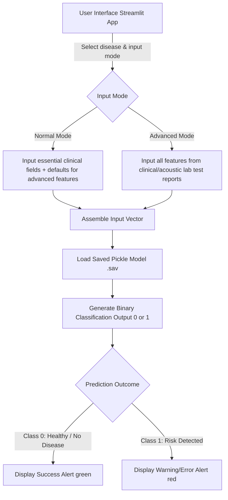

# 🏥 Unified-Disease-Prediction-Framework-For-Early-Diagnosis

A modern, web-based clinical decision support assistant built with Python, Streamlit, and Scikit-Learn. The system predicts the risk levels of three major health conditions based on user-provided medical parameters:
*   **Diabetes (Type-2)**
*   **Heart Disease**
*   **Parkinson's Disease (Voice Acoustics analysis)**

---

## ⚡ Key Features

*   **Interactive Streamlit UI**: Sleek, modern interface using a custom navigation sidebar.
*   **Dual Input Modes**:
    *   **Normal Mode**: Minimalist interface requesting only basic, everyday health metrics (e.g., Age, BMI, Blood Pressure) for a quick risk estimation.
    *   **Advanced Mode**: Comprehensive clinical inputs for medical professionals or patients with complete laboratory/acoustic test results.
*   **Acoustic Voice Analysis (Parkinson's)**: Integrates speech signal processing metrics (jitter, shimmer, fundamental frequency, HNR) to detect signs of vocal impairment characteristic of Parkinson's Disease.
*   **Real-time Inference**: Employs optimized, pre-trained classification models (serialized as `.sav` pickle files) for instant, low-latency prediction.
*   **Data Exploration & EDA**: Pre-calculated distribution and correlation analysis plots for transparent data profiling.

---

## 📊 System Architecture & Data Flow



---

## 🔬 Model Performance & Algorithm Comparison

A comparative evaluation was performed across multiple classification algorithms using **5-Fold Stratified Cross-Validation** with feature normalization (`StandardScaler`) implemented in a Scikit-Learn Pipeline to prevent data leakage during CV evaluation.

Here is the summarized result of the comparative analysis generated from [model_comparison_results.csv](file:///c:/Users/sayud/OneDrive/Documents/Somaiya/College%20Sems/4th%20Year/Sem%207/Honours/Honours%20LY_Project/Model/model_comparison_results.csv):

| Dataset | Machine Learning Model | Accuracy | Precision | Recall | F1-Score | AUC | Train Time (s) |
| :--- | :--- | :---: | :---: | :---: | :---: | :---: | :---: |
| **Diabetes** | 🏆 **Logistic Regression** | **77.47%** | **73.15%** | **57.11%** | **63.88%** | **0.8304** | **0.0139** |
| | SVM | 76.17% | 70.22% | 56.35% | 62.26% | 0.8165 | 0.1038 |
| | Random Forest | 76.69% | 69.05% | 60.45% | 64.41% | 0.8226 | 0.3345 |
| | XGBoost | 74.73% | 65.19% | 59.32% | 61.98% | 0.7914 | 0.2665 |
| | KNN | 72.78% | 62.81% | 55.23% | 58.59% | 0.7773 | 0.0085 |
| **Heart** | 🏆 **Logistic Regression** | **84.16%** | **81.95%** | **91.52%** | **86.38%** | **0.8901** | **0.0100** |
| | SVM | 82.17% | 80.98% | 89.09% | 84.59% | 0.8885 | 0.0255 |
| | Random Forest | 81.52% | 81.32% | 86.67% | 83.71% | **0.9032** | 0.2399 |
| | XGBoost | 78.56% | 78.73% | 83.64% | 80.88% | 0.8673 | 0.1932 |
| | KNN | 79.85% | 79.18% | 87.27% | 82.78% | 0.8624 | 0.0081 |
| **Parkinson's** | 🏆 **XGBoost** | **92.82%** | **94.21%** | **96.60%** | **95.32%** | **0.9737** | **0.1215** |
| | SVM | 87.18% | 86.10% | 99.31% | 92.17% | 0.8906 | 0.0113 |
| | Random Forest | 88.72% | 90.86% | 95.22% | 92.77% | 0.9616 | 0.2351 |
| | KNN | 88.72% | 92.09% | 93.22% | 92.52% | 0.9717 | 0.0045 |
| | Logistic Regression | 86.67% | 89.31% | 93.86% | 91.35% | 0.9050 | 0.0152 |

> [!NOTE]
> *   **Diabetes Model**: [diabetes_model.sav](file:///c:/Users/sayud/OneDrive/Documents/Somaiya/College%20Sems/4th%20Year/Sem%207/Honours/Honours%20LY_Project/Model/diabetes_model.sav) uses Logistic Regression based on its superior accuracy.
> *   **Heart Disease Model**: [heart_disease_model.sav](file:///c:/Users/sayud/OneDrive/Documents/Somaiya/College%20Sems/4th%20Year/Sem%207/Honours/Honours%20LY_Project/Model/heart_disease_model.sav) leverages Logistic Regression.
> *   **Parkinson's Model**: [parkinsons_model.sav](file:///c:/Users/sayud/OneDrive/Documents/Somaiya/College%20Sems/4th%20Year/Sem%207/Honours/Honours%20LY_Project/Model/parkinsons_model.sav) relies on XGBoost, which delivers high classification metrics.

---

## 📂 Project Structure

```
Model/
│
├── .vscode/                               # Workspace configuration
├── myenv/                                 # Python virtual environment directory
│
├── 📓 Notebooks & Scripts
│   ├── Diabetes.ipynb                     # EDA and model training for diabetes
│   ├── heart.ipynb                        # EDA and model training for heart disease
│   ├── parkinsons.ipynb                   # EDA and model training for Parkinson's
│   ├── model_analysis.py                  # Evaluation script comparing models
│   └── algorithm_accuracy_comparison.ipynb# Summary notebook for accuracy validation
│
├── 📊 Datasets (CSV format)
│   ├── diabetes.csv                       # Pima Indians Diabetes Dataset
│   ├── heart.csv                          # UCI Heart Disease Dataset
│   └── parkinsons.csv                     # Oxford Parkinson's Disease Vocal Dataset
│
├── ⚙️ Serialized Models (.sav files)
│   ├── diabetes_model.sav                 # Pre-trained Diabetes classifier
│   ├── heart_disease_model.sav            # Pre-trained Heart disease classifier
│   └── parkinsons_model.sav               # Pre-trained Parkinson's voice classifier
│
├── 📈 Static Visualization Outputs
│   ├── Diabetes_distribution.png          # Feature distributions for Diabetes
│   ├── Diabetes_correlation.png           # Feature correlation matrix for Diabetes
│   ├── Heart_distribution.png             # Feature distributions for Heart dataset
│   ├── Heart_correlation.png              # Feature correlation matrix for Heart dataset
│   ├── Parkinsons_distribution.png        # Feature distributions for Parkinson's
│   └── Parkinsons_correlation.png         # Feature correlation matrix for Parkinson's
│
└── 💻 Web Application Frontends
    ├── app.py                             # Core Streamlit application
    ├── app_updated.py                     # Streamlit app with Normal/Advanced modes
    └── README.md                          # Comprehensive project documentation (this file)
```

---

## 📖 Medical Parameter Input Reference Guide

This guide describes the variables, expected units, and general ranges expected by the interface:

### 1. Diabetes Predictor (Type-2)
*   **Pregnancies**: Number of times pregnant (Default: `0` for Normal mode).
*   **Blood Sugar (Glucose)**: Fasting blood glucose concentration (mg/dL). *Normal: 70–100 mg/dL, Prediabetes: 100–125 mg/dL, Diabetes: ≥126 mg/dL.*
*   **Blood Pressure**: Diastolic blood pressure (mmHg). *Normal: <80 mmHg, Hypertension Stage 1: 80–89 mmHg.*
*   **Skin Fold Thickness**: Triceps skinfold thickness (mm) used to estimate body fat.
*   **Insulin**: 2-Hour serum insulin level (µU/mL).
*   **BMI (Body Mass Index)**: Weight in kg divided by height squared in meters (kg/m²). *Normal: 18.5–24.9, Overweight: 25–29.9, Obese: ≥30.*
*   **Family History Score (Diabetes Pedigree Function)**: Genetic score measuring family history influence. *Dataset range: 0.08 to 2.42.*
*   **Age**: Age of patient in years.

### 2. Heart Disease Risk Predictor
*   **Biological Sex**: Female (`0`) or Male (`1`).
*   **Chest Symptoms (Chest Pain Type)**:
    *   *Typical Chest Pain*: Sub-sternal discomfort induced by exertion/emotional stress.
    *   *Atypical Chest Pain*: Pain not meeting all criteria of typical pain.
    *   *Non-Chest Pain Discomfort*: Pain unrelated to cardiac activity.
    *   *No Symptoms*: Asymptomatic.
*   **Resting BP**: Resting blood pressure at admission (mmHg). *Normal: <120 mmHg.*
*   **Cholesterol**: Total serum cholesterol (mg/dL). *Desirable: <200 mg/dL, High Risk: ≥240 mg/dL.*
*   **Fasting Blood Sugar > 120 mg/dL?**: Yes (`1`) or No (`0`).
*   **ECG (Resting Electrocardiographic Results)**:
    *   *Normal*: Normal ECG signature.
    *   *ST-T Wave Abnormality*: T wave inversions and/or ST elevation/depression > 0.05 mV.
    *   *Possible Left Ventricular Hypertrophy*: Ventricular enlargement diagnosed by Estes' criteria.
*   **Max Heart Rate**: Maximum heart rate achieved during stress testing (bpm).
*   **Chest Pain with Exercise? (Exercise Induced Angina)**: Yes (`1`) or No (`0`).
*   **ST Depression (Oldpeak)**: ST depression induced by exercise relative to rest (mm).
*   **ST Segment Slope**: Slope of peak exercise ST segment (Upsloping, Flat, Downsloping).
*   **# Major Vessels Seen (0-3)**: Number of major vessels colored by fluoroscopy.
*   **Thallium Stress Test**: Blood flow status in heart muscle (Normal, Fixed defect, Reversible defect).

### 3. Parkinson's Voice Check (Acoustic Biomarkers)
*   **Pitch (Fo, Hz)**: Average vocal fundamental frequency. *Normal Range: 80–250 Hz.*
*   **Highest/Lowest Pitch (Fhi & Flo, Hz)**: Maximum and minimum vocal fundamental frequencies.
*   **Jitter (%) & Jitter (Abs)**: Micro-variations in vocal pitch frequency. *Healthy: <1%.*
*   **Shimmer & Shimmer (dB)**: Micro-variations in vocal signal amplitude/loudness. *Healthy: <3.5% (or <0.35 dB).*
*   **RAP, PPQ, DDP**: Measures of pitch period perturbation.
*   **APQ3, APQ5, APQ, DDA**: Measures of amplitude perturbation quotient.
*   **NHR & HNR**: Noise-to-harmonics ratio and Harmonics-to-noise ratio. *HNR > 20 dB indicates healthy voice quality.*
*   **RPDE & D2**: Measures of signal complexity and chaotic dynamics.
*   **DFA**: Detrended fluctuation analysis measuring signal fractality.
*   **Spread1, Spread2, & PPE**: Nonlinear measures of fundamental frequency variation and pitch period entropy. *Normal PPE: <0.14.*

---

## 🚀 Installation & Running the Application

### 📋 Prerequisites
Make sure you have **Python 3.8+** installed.

### Step 1: Clone or Open the Directory
Navigate to the directory containing the project:
```powershell
cd "c:\Users\sayud\OneDrive\Documents\Somaiya\College Sems\4th Year\Sem 7\Honours\Honours LY_Project\Model"
```

### Step 2: Set Up Virtual Environment (Recommended)
Creating a virtual environment ensures dependencies do not conflict:
```powershell
python -m venv myenv
# Activate on Windows:
.\myenv\Scripts\activate
```

### Step 3: Install Dependencies
Install all required libraries via pip:
```powershell
pip install streamlit streamlit-option-menu scikit-learn pandas numpy xgboost matplotlib seaborn
```

### Step 4: Run the Application
Start the Streamlit application using the updated code:
```powershell
streamlit run app_updated.py
```

### Step 5: Access the System
Once started, the application will automatically spin up on your local host:
*   Local URL: `http://localhost:8501`
*   Network URL: Check your terminal console for the internal network IP address.

---

## ⚠️ Disclaimer

> [!WARNING]
> This application is for educational, informational, and research purposes only. The predictions generated by these machine learning models do not constitute medical diagnoses. Always consult a qualified medical professional for health evaluations and treatment plans.
